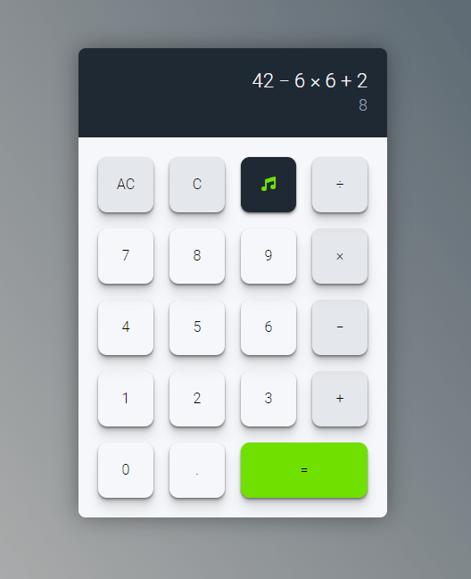

# [Calculator](https://gdimitroff.github.io/calculator/)

### Project: Calculator

An online calculator built with HTML, CSS and Vanilla JavaScript from The Odin Project [curriculum](https://www.theodinproject.com/lessons/foundations-calculator).

### Features

- Supported operations: **divide**, **multiply**, **subtract**, **add**
- Added **number rounding function** to two decimal places
- Added **backspace button** (to delete one symbol at a time) and **clear button** (to clear all display at once)
- Added sound effect with option to enable/disable them
- Added **vibration** on Android devices
- Added **decimal button**
- Added **error message** if was tried to divide by 0 or maximum character length is reached
- Added **keyboard support**
- Calculator **calculates** the whole equation dynamically
- Operations buttons (`/`, `*`, `-`, `+`, `=`) are **prevented from pushing** if there aren't any numbers in the input
- Operations buttons and decimal button (`.`) are **prevented from pushing twice**

### Outcome

- Used **HTML5 semantic elements** for better structure and readability
- Used **CSS Grid** and **CSS Flexbox** modules to create layout
- Learned how to implement **keyboard support**
- Deepened knowledge of how **functions work** together

